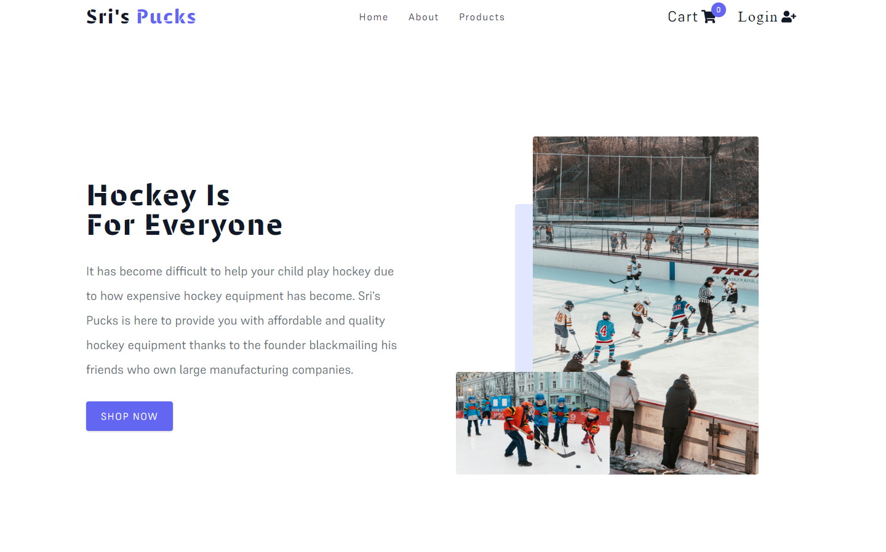
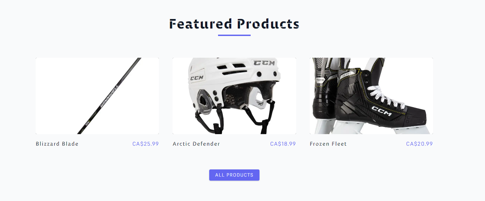
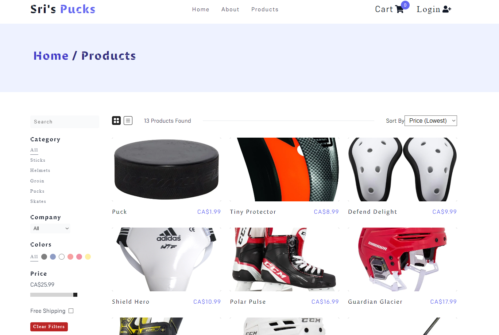
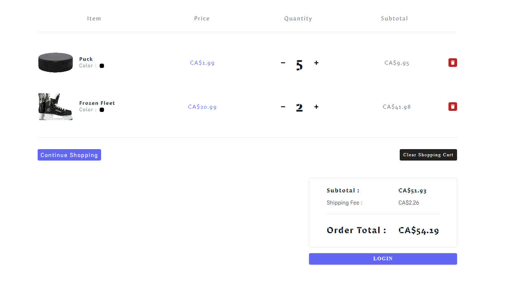
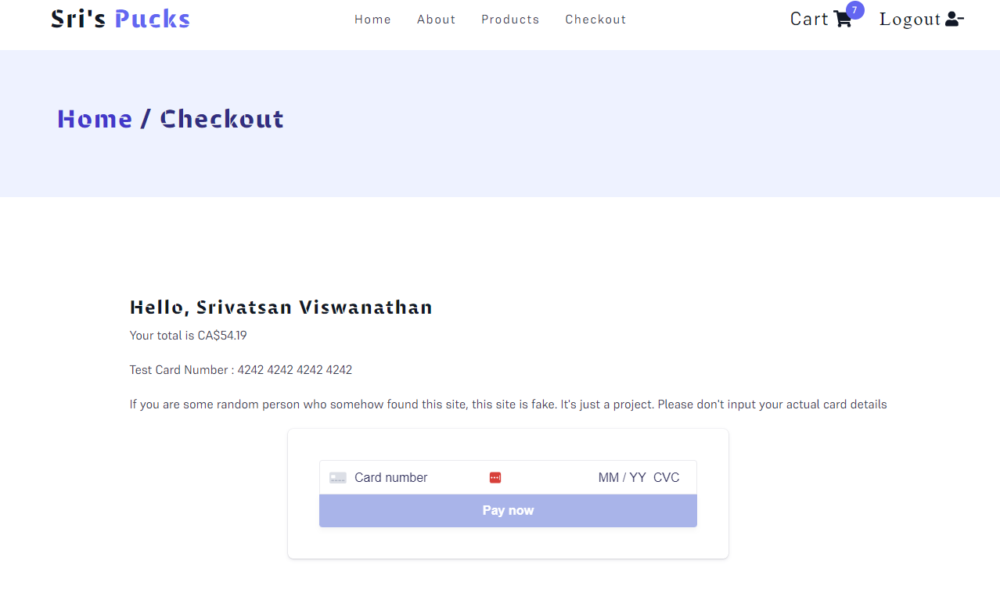

# Hockey Store

A hockey store where a person can learn a bit about the company, browse for items, add items to their cart, and purchase items. The user can't checkout until they login.

Link: https://react-hockey-store.netlify.app

## Tools Used

- HTML for displaying the content
- CSS and Styled Components for styling the website
- Javascript for rendering the content on the website and for dynamic behaviour
- React for creating reusable components and help with management of data
- React Router for managing navigation within the website
- Context API for state management
- useReducer for more complex state management scenarios
- Axios for fetching data
- Netlify Serverless functions for grabbing data from the API
- Auth0 for log in
- Airtable for creating the API

## Images

## Link

Link: https://react-hockey-store.netlify.app
